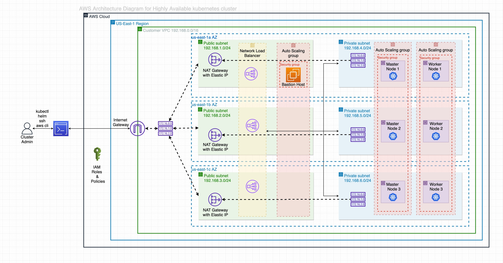

# kubernetes-self-managed-cluster-AWS



Instantiation of infrastructure requires an AWS provider with the following credentials

```
provider "aws" {
  region  = "<AWS_REGION_HERE>"
  profile = "<AWS_PROFILE_HERE>"
}
```
